<!-- ╔══════════════════════════════════════════════════════════╗ -->
<!-- ║        NIK AI CORE  ✦  PROFILE ENGINE v1.0               ║ -->
<!-- ║          Custom HUD  ·  Dashboard Layout                 ║ -->
<!-- ╚══════════════════════════════════════════════════════════╝ -->

<!-- ░░░░░░░░░  CUSTOM ANIMATED SVG HUD BANNER  ░░░░░░░░░ -->
<div align="center">

</div>

<!-- ░░░░░░░░░  IDENTITY TYPING  ░░░░░░░░░ -->
<div align="center">


<br/>

<!-- BADGE ROW -->
<a href="https://github.com/nikhilsomvanshi60">

</a>
&ensp;

&ensp;

&ensp;


</div>

<br/>

<br/>

---

<!-- ░░░░░░░░░  WHO AM I — 2-PANEL LAYOUT  ░░░░░░░░░ -->

<table>
<tr>
<td width="50%" valign="top">

### `◈ AGENT DOSSIER — NIK`

```
╔══════════════════════════════════════════╗
║  DESIGNATION : NIKHIL SOMVANSHI          ║
║  CODENAME    : NIK                       ║
║              : [Neural Intel Kernel]     ║
║  DIVISION    : NIK AI TECHNOLOGY         ║
║  ROLE        : AI Engineer + Cyber       ║
║                Security Analyst          ║
║  CITY        : Vadodara, Gujarat, India  ║
║  PASSION     : AI  ×  Security  ×  Art   ║
║  PHILOSOPHY  : Build AI. Secure Systems. ║
║                Write Code. Tell Stories. ║
║  STATUS      : ● ACTIVE | ◈ BUILDING     ║
╚══════════════════════════════════════════╝
```

> *"I live at the intersection of Artificial Intelligence and Cybersecurity — where every prompt is a spell and every script is a story."*

</td>
<td width="50%" valign="top" align="center">


<br/><br/>


</td>
</tr>
</table>

<br/>

<br/>

---

<!-- ░░░░░░░░░  NIK AI CORE  ░░░░░░░░░ -->
<div align="center">

## 🔮 &nbsp; NIK AI ASSISTANT — CORE INTELLIGENCE &nbsp; 🔮


</div>

<br/>

```python
# ╔══════════════════════════════════════════════════════════════╗
# ║         NIK AI ASSISTANT  ·  Neural Intelligence Kernel      ║
# ║         Version  :  6.0.DASHBOARD.ULTRA                      ║
# ╚══════════════════════════════════════════════════════════════╝

class NIK_AI_ASSISTANT:

    identity = {
        "full_name" : "Nikhil Somvanshi",
        "codename"  : "NIK  —  Neural Intelligence Kernel",
        "division"  : "NIK AI TECHNOLOGY",
        "version"   : "1.0  ·  DASHBOARD.ULTRA",
        "origin"    : "Vadodara, Gujarat, India  🇮🇳",
        "motto"     : "From curiosity to code. From code to change.",
    }

    core_capabilities = {
        "🔮  Prompt Engineering"  : "Crafting precision spells for LLMs",
        "🛡️  Cyber Intelligence" : "Hunting threats before they hunt you",
        "🤖  AI Agent Design"    : "Systems that think, decide, and act",
        "📡  LLM Orchestration"  : "Conducting symphonies of neural networks",
        "🌙  Night Mode"         : "Best ideas arrive at 2 AM  ☕",
    }

    learning_stack = [
        "Advanced Prompt Chaining",  "RAG + Vector Databases",
        "Autonomous Agent Loops",    "Ethical Hacking",
        "Network Penetration",       "LLM Fine-Tuning",
    ]

    def activate(self) -> str:
        return "✦  NIK AI — Where technology meets soul.  ✦"

    def __repr__(self) -> str:
        return f"NIK v1.0 | {self.identity['origin']} | ONLINE"
```

<br/>

<br/>

---

<!-- ░░░░░░░░░  CYBERSECURITY  ░░░░░░░░░ -->
<div align="center">

## 🛡️ &nbsp; CYBERSECURITY COMMAND &nbsp; 🛡️


<br/><br/>

</div>

<table align="center">
<tr>
<td align="center" width="33%">

**🔴 OFFENSIVE**


</td>
<td align="center" width="33%">

**🔵 DEFENSIVE**


</td>
<td align="center" width="33%">

**🟣 INTELLIGENCE**


</td>
</tr>
</table>

<br/>

<div align="center">

```
  ╔══════════════════════════════════════════════════════════════════════╗
  ║          ✦   N I K   S E C U R I T Y   M A T R I X   ✦              ║
  ╠══════════════════════════╦═══════════════════════════════════════════╣
  ║  Penetration Testing     ║  ▰▰▰▰▰▰▰▰▰▰▰▰▰▱▱  88%    🔴   ║
  ║  Network Security        ║  ▰▰▰▰▰▰▰▰▰▰▰▰▱▱▱  82%    🔵   ║
  ║  Web App Security        ║  ▰▰▰▰▰▰▰▰▰▰▰▱▱▱▱  79%    🔵   ║
  ║  OSINT & Recon           ║  ▰▰▰▰▰▰▰▰▰▰▰▰▰▱▱  86%    🟣   ║
  ║  Security Automation     ║  ▰▰▰▰▰▰▰▰▰▰▰▰▰▰▱  92%    ⚡   ║
  ║  Threat Intelligence     ║  ▰▰▰▰▰▰▰▰▰▰▰▰▱▱▱  83%    🟣   ║
  ╚══════════════════════════╩═══════════════════════════════════════════╝
```

</div>

<br/>

<br/>

---

<!-- ░░░░░░░░░  AI UNIVERSE  ░░░░░░░░░ -->
<div align="center">

## 🧠 &nbsp; AI & PROMPT ENGINEERING UNIVERSE &nbsp; 🧠

<table>
<tr>
<td align="center">

**★ Expert**<br/>


</td>
<td align="center">

**★ Advanced**<br/>


</td>
<td align="center">

**★ Builder**<br/>


</td>
<td align="center">

**★ Active**<br/>


</td>
</tr>
</table>

<br/>


&ensp;

&ensp;

&ensp;

&ensp;

&ensp;

&ensp;

&ensp;


</div>

<br/>

<br/>

---

<!-- ░░░░░░░░░  TECH ARSENAL  ░░░░░░░░░ -->
<div align="center">

## ⚡ &nbsp; TECHNOLOGY COMMAND CENTER &nbsp; ⚡

<table>
<tr>
<td align="center" width="50%">

**— LANGUAGES —**


</td>
<td align="center" width="50%">

**— TOOLS & PLATFORMS —**


</td>
</tr>
</table>

</div>

<br/>

<br/>

---

<!-- ░░░░░░░░░  GITHUB STATS DASHBOARD  ░░░░░░░░░ -->
<div align="center">

## 📊 &nbsp; SYSTEM PERFORMANCE DASHBOARD &nbsp; 📊

<br/>


&ensp;


<br/><br/>


</div>

<br/>

<br/>

---

<!-- ░░░░░░░░░  TROPHIES  ░░░░░░░░░ -->
<div align="center">

## 🏆 &nbsp; ACHIEVEMENT VAULT &nbsp; 🏆

<br/>

<table>
<tr>
<td align="center" width="25%">


<br/><sub><b>Joined the AI Revolution Early</b></sub>

</td>
<td align="center" width="25%">


<br/><sub><b>Built Autonomous AI Agents</b></sub>

</td>
<td align="center" width="25%">


<br/><sub><b>Ethical Hacker & Defender</b></sub>

</td>
<td align="center" width="25%">


<br/><sub><b>Expert Prompt Engineer</b></sub>

</td>
</tr>
<tr>
<td align="center" width="25%">


<br/><sub><b>Codes Best at 2 AM ☕</b></sub>

</td>
<td align="center" width="25%">


<br/><sub><b>Orchestrates Neural Networks</b></sub>

</td>
<td align="center" width="25%">


<br/><sub><b>Automates Everything</b></sub>

</td>
<td align="center" width="25%">


<br/><sub><b>Vadodara → The World</b></sub>

</td>
</tr>
</table>

</div>

<br/>

<br/>

---

<!-- ░░░░░░░░░  ACTIVITY  ░░░░░░░░░ -->
<div align="center">

## 📡 &nbsp; LIVE ACTIVITY PULSE &nbsp; 📡

<br/>


</div>

<br/>

<br/>

---

<!-- ░░░░░░░░░  DEV HUMOR — UNIQUE SECTION  ░░░░░░░░░ -->
<div align="center">

## 😄 &nbsp; NIK AI HUMOR MODULE &nbsp; 😄

<br/>


<br/>

```js
// NIK AI :: DAILY DEBUG LOG
console.log("Why do programmers prefer dark mode?");
console.log("→ Because light attracts bugs! 🐛");
console.log("");
console.log("NIK AI Tip: Every great codebase starts with");
console.log("          a single commit and a lot of chai ☕");
```

</div>

<br/>

<br/>

---

<!-- ░░░░░░░░░  GROWTH LOG  ░░░░░░░░░ -->
<div align="center">

## 🌱 &nbsp; NIK GROWTH LOG &nbsp; 🌱

<br/>

<!-- NIK_GROWTH_LOG_START -->
```
  ╔════════════════════════════════════════════════════════════════════════╗
  ║              ✦   N I K   G R O W T H   L O G   ✦                      ║
  ╠═══════════════════════════╦════════════════════════════════════════════╣
  ║  Prompt Engineering       ║  ▰▰▰▰▰▰▰▰▰▰▰▰▰▰▱  95%  🔮                  ║
  ║  AI Agent Development     ║  ▰▰▰▰▰▰▰▰▰▰▰▰▱▱▱  82%  🤖                  ║
  ║  Security Automation      ║  ▰▰▰▰▰▰▰▰▰▰▰▰▰▱▱  84%  ⚡                  ║
  ║  New Skills — Daily       ║  ▰▰▰▰▰▰▰▰▰▰▰▰▰▱▱  89%  📚                  ║
  ║  Cybersecurity Research   ║  ▰▰▰▰▰▰▰▰▰▰▰▱▱▱▱  75%  🛡️                  ║
  ║  LLM Fine-Tuning          ║  ▰▰▰▰▰▰▰▰▰▰▰▰▱▱▱  79%  🧠                  ║
  ╚═══════════════════════════╩════════════════════════════════════════════╝
```
<!-- NIK_GROWTH_LOG_END -->

</div>

<br/>

<br/>

---

<!-- ░░░░░░░░░  PHILOSOPHY  ░░░░░░░░░ -->
<div align="center">

## 🌙 &nbsp; THE PHILOSOPHY OF NIK &nbsp; 🌙

<br/>


<br/><br/>

> **✦** &nbsp; *"Between every line of code, there is a dream waiting to be lived.  
> I don't just write programs — I write the future, one commit at a time."*  
>
> — **Nikhil Somvanshi** · Creator of NIK AI ASSISTANT

</div>

<br/>

<br/>

---

<!-- ░░░░░░░░░  CONNECT  ░░░░░░░░░ -->
<div align="center">

## 🔗 &nbsp; OPEN CHANNELS &nbsp; 🔗

<br/>

[](https://github.com/nikhilsomvanshi60)
&ensp;
[](https://www.linkedin.com/in/nikhil-somvanshi-09a303367?utm_source=share_via&utm_content=profile&utm_medium=member_android)
&ensp;
[](https://www.instagram.com/nikhil_somvanshi_60?igsh=cnkydHFzM3V1NXpr)
&ensp;
[](https://x.com/XprRed90483)
&ensp;
[](https://youtube.com/@nikhil001-p?si=rWStJq8GDiC_ilSC)
&ensp;
[](https://t.me/KINGMANS12)

<br/><br/>

`AI Projects` &nbsp;·&nbsp; `Security Research` &nbsp;·&nbsp; `Open Source` &nbsp;·&nbsp; `Creative Tech` &nbsp;·&nbsp; `Collaborations`

</div>

<br/>

<br/>

---

<!-- ░░░░░░░░░  PROJECTS  ░░░░░░░░░ -->
<div align="center">

## 🚀 &nbsp; FEATURED MODULES &nbsp; 🚀

</div>

<!-- LATEST_REPOS_START -->
- [**Enterprise-Call-Reports**](https://github.com/nikhilsomvanshi60/Enterprise-Call-Reports) - No description provided. (`JavaScript`)
- [**nikhilsomvanshi60**](https://github.com/nikhilsomvanshi60/nikhilsomvanshi60) - No description provided. (`JavaScript`)
- [**Nik-companion**](https://github.com/nikhilsomvanshi60/Nik-companion) - No description provided. (`Python`)

<!-- LATEST_REPOS_END -->

<br/>

---

<!-- ░░░░░░░░░  DAILY TRANSMISSION  ░░░░░░░░░ -->
<div align="center">

## 💌 &nbsp; NIK AI DAILY TRANSMISSION &nbsp; 💌

</div>

<!-- QUOTE_START -->
> *"Algorithm: A word used by programmers when they don't want to explain how their code works."*
<!-- QUOTE_END -->

<br/>

---

<!-- ░░░░░░░░░  FOOTER  ░░░░░░░░░ -->
<div align="center">


<br/>


<sub>
<!-- LAST_SYSTEM_SYNC_START -->
_Tue, 07 Jul 2026 02:34:05 GMT_
<!-- LAST_SYSTEM_SYNC_END -->
&ensp;|&ensp; Crafted with &nbsp;💜&nbsp;☕&nbsp;&amp;&nbsp;🌙&nbsp; by &nbsp;<strong>Nikhil Somvanshi</strong>
</sub>

</div>
